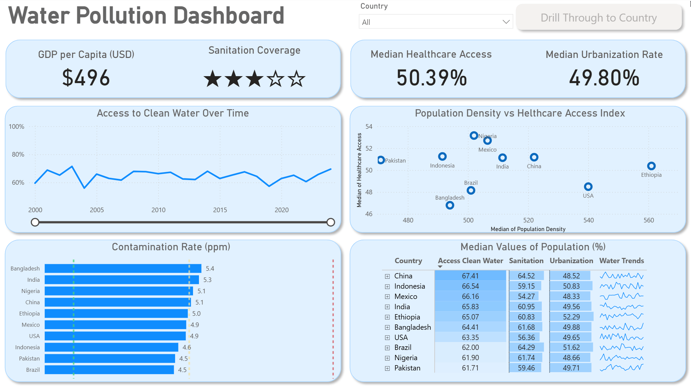
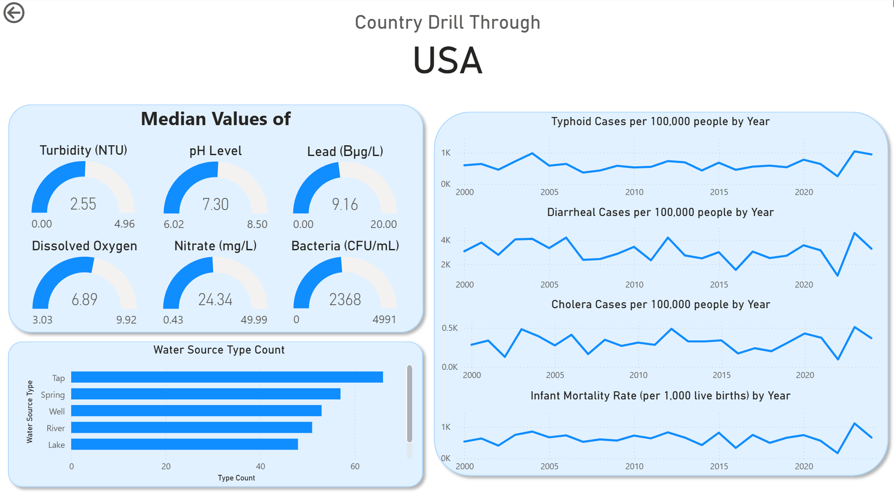

# Water Pollution Dashboard w/ Power BI

## 🌊 Introduction

This interactive Power BI dashboard was created to explore environmental and water quality conditions across 10 countries using a variety of indicators such as contaminant levels, access to clean water, sanitation coverage, healthcare access, and urbanization rates.

The dashboard provides dynamic filtering and drill-through features, enabling users to:

-   Track access to clean water and healthcare over time.
-   Compare contamination levels, sanitation coverage, and population density across countries.
-   View detailed country-level breakdowns of water quality metrics (e.g., pH, turbidity, lead, nitrate, bacteria).
-   Explore disease-related trends such as typhoid, cholera, and infant mortality rates.

This project was part of my Power BI learning journey, where I practiced building professional, interactive dashboards to analyze complex datasets and present insights clearly.

🔗 Data Source: [Water Pollution and Disease Dataset on Kaggle](https://www.kaggle.com/datasets/khushikyad001/water-pollution-and-disease/data)

⚠️ Disclaimer: The dataset used in this project contains simulated values and does not represent actual real-world statistics. All results and insights are for demonstration and learning purposes only.

## 📊 Dashboard File
My final dashboard is in [Water_Pollution_Dashbaord.pbix](Water_Pollution_Dashbaord.pbix)

## Skills Showcased

This project was a journey through key Power BI features. Here's a look at what we mastered:

-   **⚙️ Data Transformation (ETL) with Power Query:** Cleaned, shaped, and prepared the raw data for analysis by handling blanks, changing data types, and creating new columns.
-   **🧮 Implicit Measures:** Formulated measures to derive key insights and KPIs like `Median Healthcare Access` and `GDP per Capita`.
-   **📊 Core Charts:** Utilized **Column, Bar, Line,** and **Area Charts** to compare contamination rates and track trends over time.
-   **🔢 KPI Indicators & Tables:** Used **Cards** to display key metrics and **Tables** to provide granular, sortable data.
-   **🎨 Dashboard Design:** Designed an intuitive and visually appealing layout, exploring both common and uncommon chart types to best tell the data story.
-   **🖱️ Interactive Reporting:**
    -   **Slicers:** To dynamically filter the report by Job Title.
    -   **Buttons & Bookmarks:** To create a seamless navigation experience.
    -   **Drill-Through:** To navigate from a high-level summary to a contextual, detailed view.

## Dashboard Overview

*This report is split into two distinct pages to provide both a high-level summary and a detailed analysis.*

### Page 1: High-Level Environmental View

This page provides an overview of water quality and related socio-economic conditions across 10 countries. It highlights key indicators such as GDP per capita, sanitation coverage, healthcare access, and urbanization rates. Users can explore trends in access to clean water, compare contamination levels, and analyze the relationship between population density and healthcare access. Together, these visuals give a quick snapshot of how environmental and public health factors interact at a global scale.

### Page 2: Country Drill Through

This is the deep-dive page. From the main dashboard, you can drill through to focus on a single country and explore its specific water quality indicators. The page highlights median values of key water parameters such as turbidity, pH, dissolved oxygen, and contaminants, alongside health outcomes like typhoid, diarrheal diseases, cholera, and infant mortality rates. It also shows the distribution of different water sources, giving a more detailed picture of how water quality links to public health at the national level.

## Conclusion

This dashboard demonstrates how Power BI can be leveraged to monitor and analyze water pollution trends across regions, providing insights into contamination levels, seasonal variations, and potential areas of concern. Although the dataset used here is simulated for demonstration purposes, the same analytical approach can be applied to real-world data, enabling organizations and policymakers to make informed decisions, strengthen environmental monitoring, and guide sustainable water management strategies.