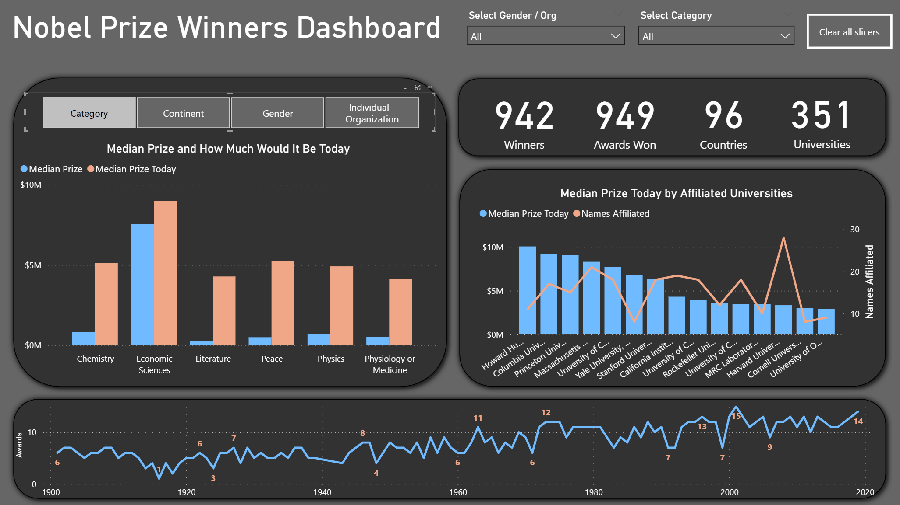

# Nobel Prize Dashboard Dashboard w/ Power BI

## 🏆 Introduction

This interactive Power BI dashboard was built to explore over a century of Nobel Prize awards, offering insights into winners, affiliated universities, countries, and prize values (both original and adjusted for today).

The dashboard provides dynamic filtering and parameter-driven views, enabling users to:

-   Analyze median Nobel Prize values across different categories, both historical and adjusted for today.
-   Compare awards distribution by category, continent, gender, and individual vs. organization.
-   Explore university affiliations, including prize values and the number of Nobel Laureates tied to each institution.
-   Track the trend of Nobel Prizes awarded over time with yearly breakdowns.

This project was part of my Power BI practice journey, designed to strengthen skills in interactive dashboarding, advanced measures, and parameter usage while telling the story of one of the world’s most prestigious awards.

🔗 Data Source: [All Nobel Prize winners from 1901-2025.03 on Kaggle](https://www.kaggle.com/datasets/jehanbhathena/all-nobel-prize-winners-from-1901-2024)

## 📊 Dashboard File

My final dashboard is in [Nobel_Prize_Data_Analysis.pbix](Nobel_Prize_Data_Analysis.pbix)

## 🛠️ Skills Showcased

This project demonstrates a wide range of Power BI skills, including:

- **⚙️ Data Transformation (Power Query):**

    -   Cleaned and standardized the Nobel Prize dataset.
    -   Restructured the affiliation fields (originally spread across four columns) into a separate table with **Name, Affiliation, and Index,** linked back to the main dataset for accurate university-level analysis.
    -   Added a unique Index column to replace duplicated IDs in the source.

- **🧮 Custom Measures (DAX):**

    -   Built explicit measures for KPIs such as total winners, awards, countries, and universities.
    -   Created measures for Median Prize and Median Prize (Today’s Value) to compare historical vs. inflation-adjusted amounts.
    -   Designed calculations to update dynamically with slicers and parameters.

- **📊 Visualizations:**

    -   **Column & Line Combo Charts –** compared median prize values with university affiliations.
    -   **Bar Charts –** analyzed prize distribution across categories.
    -   **Line Charts –** tracked Nobel Prize awards over time.
    -   **Cards –** highlighted summary figures at a glance.

- **🎛️ Parameters & Slicers:**

    -   Interactive filtering by Category, Continent, Gender, and Individual/Organization.

- **🎨 Dashboard Design:**

    -   Modern dark-themed layout focused on clarity, balance, and storytelling.

### Dashboard Overview

This interactive Nobel Prize Winners Dashboard provides a single-page view of the most important insights into over a century of Nobel history. It highlights key performance indicators (KPIs) such as Total Winners, Awards, Countries, and Universities, while also enabling deeper exploration of prize amounts, categories, and institutional affiliations.

## 🏆 Conclusion

This dashboard showcases Power BI’s ability to transform complex historical data into a clear, accessible, and interactive analytical tool. By combining dynamic filters, explicit measures, and thoughtful design, the report makes it easy to explore how Nobel Prizes have evolved in value, distribution, and representation over time.

Whether you’re interested in the financial evolution of the prize, the dominance of certain institutions, or the spread of awards across categories and regions, this dashboard provides an engaging way to investigate one of the world’s most prestigious honors.