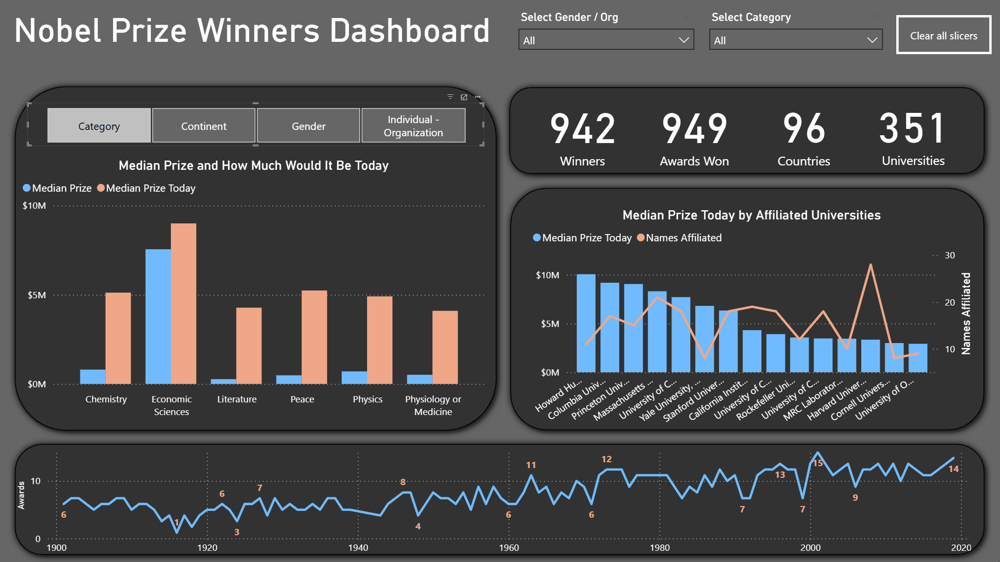

# Power BI Projects 📊

Welcome to my Power BI Projects repository!
This repo collects my interactive dashboards and analyses created as part of my Power BI learning and practice journey. Each project explores a unique dataset and demonstrates different aspects of data transformation, DAX calculations, and dashboard design.

🔎 Inside this repository, you’ll find:

# 📂 Projects

## 🌊 Water Pollution Dashboard

(./Project_1/README.md)

-   Explores environmental and water quality conditions across 10 countries.
-   Features drill-through analysis, KPIs, and interactive navigation.
-   Demonstrates ETL with Power Query, implicit measures, and dashboard storytelling.

## 🏆 Nobel Prize Dashboard

(./Project_2/README.md)

-   Analyzes over a century of Nobel Prize awards.
-   Offers insights into prize values, categories, countries, and universities.
-   Showcases advanced DAX measures, parameter usage, and dark-themed design.

## 🛠️ Skills Highlighted

-   Data transformation with Power Query
-   DAX measures (implicit & explicit)
-   Interactive reporting (slicers, bookmarks, drill-through)
-   Dashboard design & storytelling

## 📑 About

All dashboards are created for learning and demonstration purposes, based on publicly available datasets.

👉 Feel free to explore the project folders above to see detailed breakdowns and dashboards.
